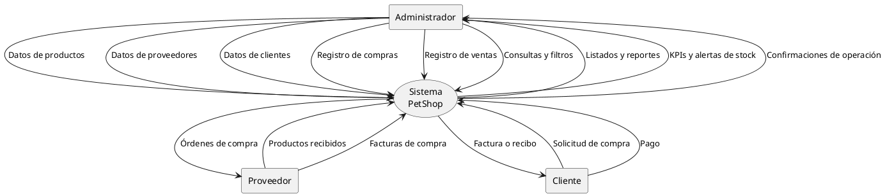
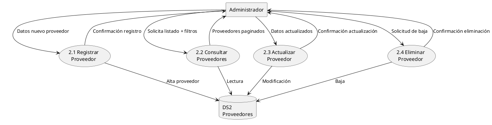
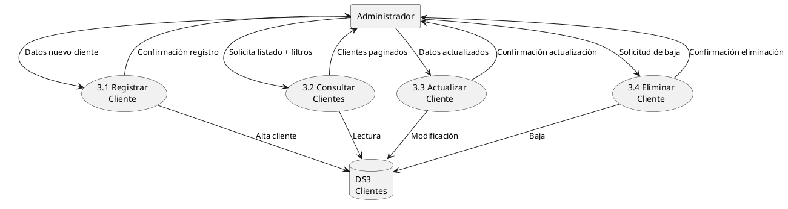
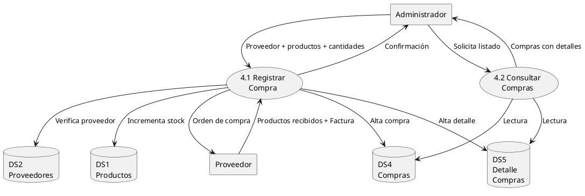
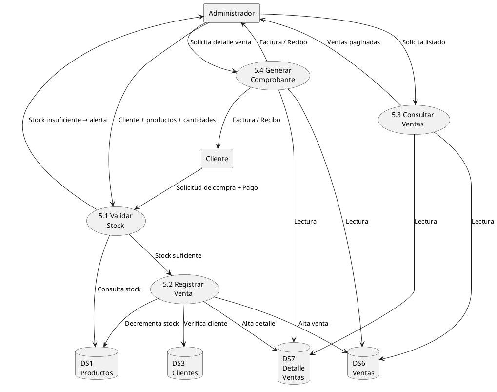
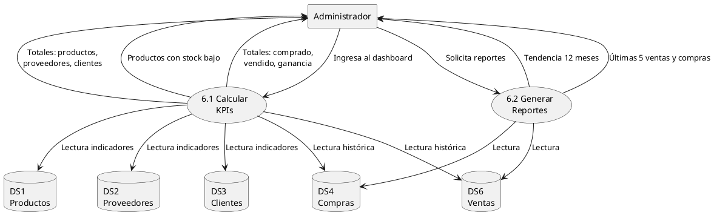

# Análisis Estructurado — Sistema PetShop

> **Metodología:** Análisis Estructurado Moderno (Yourdon)
> **Proyecto:** PetShop — Sistema de Gestión de Inventario y Punto de Venta
> **Tecnología:** Laravel 13 / PHP 8.3 / SQLite / TailwindCSS
> **Versión:** 1.0

---

## Índice

1. [Relevamiento del Sistema](#1-relevamiento-del-sistema)
2. [Declaración de Propósitos](#2-declaración-de-propósitos)
3. [Diagrama de Contexto](#3-diagrama-de-contexto)
4. [Lista de Acontecimientos](#4-lista-de-acontecimientos)
5. [Diagramas de Flujo de Datos](#5-diagramas-de-flujo-de-datos)
   - 5.1 [DFD Nivel 1 — Procesos principales](#51-dfd-nivel-1--procesos-principales)
   - 5.2 [DFD Nivel 2 — Gestión de Productos](#52-dfd-nivel-2--gestión-de-productos)
   - 5.3 [DFD Nivel 2 — Gestión de Proveedores](#53-dfd-nivel-2--gestión-de-proveedores)
   - 5.4 [DFD Nivel 2 — Gestión de Clientes](#54-dfd-nivel-2--gestión-de-clientes)
   - 5.5 [DFD Nivel 2 — Gestión de Compras](#55-dfd-nivel-2--gestión-de-compras)
   - 5.6 [DFD Nivel 2 — Gestión de Ventas](#56-dfd-nivel-2--gestión-de-ventas)
   - 5.7 [DFD Nivel 2 — Dashboard y KPIs](#57-dfd-nivel-2--dashboard-y-kpis)
6. [Diccionario de Datos](#6-diccionario-de-datos)
7. [Especificación de Procesos](#7-especificación-de-procesos)
8. [Determinación de la Frontera de Automatización](#8-determinación-de-la-frontera-de-automatización)
9. [Restricciones Operacionales](#9-restricciones-operacionales)
10. [Diagrama de Entidad-Relación](#10-diagrama-de-entidad-relación)

---

## 1. Relevamiento del Sistema

### 1.1 Presentación de la empresa

**Italia Pet Shop — Forraje y Jardín** es un comercio minorista dedicado a la venta de artículos para mascotas, forraje, accesorios de jardinería y productos relacionados. Está orientado a un público local que busca atención personalizada, variedad de productos y precios competitivos.

El negocio surge de la necesidad de ofrecer en un solo lugar tanto alimentos y accesorios para animales (perros, gatos, aves, roedores, peces, y animales de granja) como productos para el hogar y el jardín (semillas, tierra abonada, macetas, fertilizantes, herramientas de jardinería).

### 1.2 Estructura del negocio

La operación del comercio se apoya en los siguientes roles:

| Rol | Responsabilidad |
|-----|----------------|
| **Dueño / Encargado** | Supervisión general, toma de decisiones, contacto con proveedores, control de caja. |
| **Vendedor / Atención al público** | Atención cara a cara, cobro, reposición de góndola, consultas de stock. |
| **Repositor / Cadete** | Recepción de mercadería, etiquetado, organización del depósito, distribución en góndola. |

En la práctica, en un negocio de este tipo los roles suelen superponerse: el dueño atiende al público, el vendedor repone mercadería, etc. La cantidad de personas involucradas varía entre 1 y 4 dependiendo del día y la demanda.

### 1.3 Descripción del funcionamiento actual

#### Atención al cliente

El cliente llega al local, consulta productos directamente en góndola o pregunta al vendedor. Si el producto está visible, lo toma y lo lleva a caja. Si no encuentra lo que busca, pregunta al vendedor, quien revisa si hay stock en el depósito. Si no hay, sugiere un producto alternativo o le indica al cliente que vuelva cuando llegue mercadería.

El pago se realiza en efectivo, débito, crédito o transferencia. Se entrega un ticket o factura manual o electrónica según el caso.

#### Gestión de proveedores

El encargado se comunica con los proveedores vía WhatsApp o teléfono. Pide precios, verifica disponibilidad y realiza el pedido. La mercadería llega en camioneta o flete propio. Al recibirla, se verifica contra la factura, se etiqueta y se coloca en góndola o depósito.

Los proveedores son tanto distribuidores mayoristas de alimentos y accesorios (ej. Nestlé Purina, Vitalcan, etc.) como viveros o distribuidores de insumos de jardinería.

#### Control de stock

El control de stock se realiza de forma visual o mediante planillas manuales. Periódicamente (semanal o quincenalmente), el encargado recorre la góndola y el depósito, anota lo que falta y genera pedidos. No existe un sistema centralizado que indique en tiempo real cuánto hay de cada producto.

Esto genera problemas:

- **Falta de stock:** Se descubren productos agotados cuando el cliente los pide.
- **Exceso de stock:** Se piden productos que todavía había, generando sobrestock y productos vencidos.
- **Pérdida de información:** No hay registro histórico confiable de qué se vendió, a qué precio, y con qué ganancia.

#### Registro de ventas y compras

Las ventas se registran en una planilla diaria o mediante un sistema de facturación electrónica básico (según el tipo de comprobante requerido). Las compras se archivan en carpetas físicas o digitales con las facturas de los proveedores.

No existe un sistema que relacione compras con ventas, por lo que calcular la ganancia real del negocio requiere trabajo manual y estimaciones.

### 1.4 Flujo de trabajo típico (escenario diario)

1. El encargado abre el local, revisa el estado general y la caja.
2. Durante el día, los clientes ingresan, consultan, compran y pagan.
3. Cada venta se registra (manual o electrónicamente) y se entrega comprobante.
4. Si un cliente pide un producto sin stock, se anota mentalmente o en un papel.
5. Al cierre, se suma la recaudación, se confronta con las ventas registradas.
6. Periódicamente, se revisa el stock y se hacen pedidos a proveedores.

### 1.5 Debilidades observadas

| Problema | Impacto |
|----------|---------|
| Stock no centralizado ni en tiempo real | Pérdida de ventas por falta de stock, sobrestock innecesario |
| Registro manual de ventas | Errores de tipeo, pérdida de información, dificultad para calcular ganancia |
| Sin historial de rentabilidad por producto | No se sabe qué productos dejan más ganancia |
| Comunicación desorganizada con proveedores | Pedidos duplicados u olvidados, precios desactualizados |
| Dependencia de la memoria del vendedor | Si el vendedor no está, no se sabe dónde están los productos ni qué falta |
| Sin alertas de stock bajo | Se descubre el faltante cuando el cliente lo pide |

---

## 2. Declaración de Propósitos

El sistema **PetShop** se encarga de gestionar el inventario de productos, el registro de proveedores y clientes, y las operaciones de compra y venta de una tienda de artículos para mascotas, forraje y jardinería. Su propósito es centralizar la información comercial y contable, automatizar el cálculo de stock en tiempo real, y brindar indicadores clave de rendimiento (KPIs) para la toma de decisiones de negocio.

**Alcance del sistema:**

- Administración del catálogo de productos con categorías, precios e imágenes.
- Gestión del registro de proveedores y clientes.
- Control de compras a proveedores con registro de detalles y costos.
- Procesamiento de ventas con validación de stock previa.
- Cálculo dinámico del stock (stock inicial + compras − ventas).
- Seguimiento de rentabilidad por venta (costo de compra al momento de la venta).
- Dashboard con KPIs: productos bajos de stock, totales de compra/venta/ganancia, y tendencias a 12 meses.
- Autenticación de usuarios con verificación de correo electrónico.

---

## 3. Diagrama de Contexto

El sistema se modela como un único proceso (nivel 0) que intercambia flujos de datos con tres entidades externas: el **Administrador** (usuario del sistema), el **Proveedor** (fuente de productos) y el **Cliente** (destino de ventas).



### Entidades externas

| Entidad | Descripción |
|---------|-------------|
| **Administrador** | Usuario autenticado que opera el sistema: CRUD de productos, proveedores, clientes, y registro de compras y ventas. |
| **Proveedor** | Entidad externa que suministra productos a la tienda. Provee mercadería y facturas; recibe órdenes de compra. |
| **Cliente** | Comprador final. Realiza solicitudes de compra y pagos; recibe facturas o recibos. |

---

## 4. Lista de Acontecimientos

Cada estímulo del entorno produce una respuesta del sistema. Se listan a continuación los acontecimientos identificados:

| ID | Estímulo (Entrada) | Origen | Respuesta (Salida) | Destino |
|----|-------------------|--------|-------------------|---------|
| E01 | Administrador solicita listado de productos | Admin | Listado paginado de productos con stock y proveedor | Admin |
| E02 | Administrador envía datos de nuevo producto | Admin | Producto registrado + confirmación | Admin |
| E03 | Administrador envía datos actualizados de producto | Admin | Producto actualizado + confirmación | Admin |
| E04 | Administrador solicita eliminación de producto | Admin | Producto eliminado + confirmación | Admin |
| E05 | Administrador solicita listado de proveedores | Admin | Listado paginado de proveedores | Admin |
| E06 | Administrador envía datos de nuevo proveedor | Admin | Proveedor registrado + confirmación | Admin |
| E07 | Administrador envía datos actualizados de proveedor | Admin | Proveedor actualizado + confirmación | Admin |
| E08 | Administrador solicita eliminación de proveedor | Admin | Proveedor eliminado + confirmación | Admin |
| E09 | Administrador solicita listado de clientes | Admin | Listado paginado de clientes | Admin |
| E10 | Administrador envía datos de nuevo cliente | Admin | Cliente registrado + confirmación | Admin |
| E11 | Administrador envía datos actualizados de cliente | Admin | Cliente actualizado + confirmación | Admin |
| E12 | Administrador solicita eliminación de cliente | Admin | Cliente eliminado + confirmación | Admin |
| E13 | Administrador envía datos de nueva compra (proveedor + productos + cantidades) | Admin | Compra registrada con detalles + stock actualizado + confirmación | Admin |
| E14 | Administrador solicita listado de compras | Admin | Listado paginado de compras | Admin |
| E15 | Administrador envía datos de nueva venta (cliente + productos + cantidades) | Admin | Validación de stock → venta registrada con detalles + actualización de rentabilidad + confirmación | Admin |
| E16 | Administrador solicita listado de ventas | Admin | Listado paginado de ventas | Admin |
| E17 | Administrador solicita detalle de una venta | Admin | Detalle completo de la venta (productos, cantidades, subtotales) | Admin |
| E18 | Administrador ingresa al dashboard | Admin | KPIs: total productos, proveedores, clientes, stock bajo, total comprado/vendido/ganancia, últimas operaciones, tendencia 12 meses | Admin |
| E19 | Stock de un producto cae por debajo del umbral | Sistema | Marca visual de "stock bajo" en listados y dashboard (alerta proactiva) | Admin |
| E20 | (Mensualmente) — Cierre de período contable | Sistema | Actualización de tendencias históricas en dashboard | Admin |

---

## 5. Diagramas de Flujo de Datos

> **Notación:** Los procesos se representan como círculos `(())`, los almacenes de datos como `[( )]`, las entidades externas como `[ ]` y los flujos como flechas etiquetadas.

### 5.1 DFD Nivel 1 — Procesos principales

```plantuml
@startuml
skinparam backgroundColor #FFFFFF

rectangle "Administrador" as ADMIN
rectangle "Proveedor" as PROV
rectangle "Cliente" as CLI

usecase "1 Gestionar\nProductos" as P1
usecase "2 Gestionar\nProveedores" as P2
usecase "3 Gestionar\nClientes" as P3
usecase "4 Gestionar\nCompras" as P4
usecase "5 Gestionar\nVentas" as P5
usecase "6 Generar\nDashboard" as P6

database "DS1\nProductos" as DS_PROD
database "DS2\nProveedores" as DS_PROV
database "DS3\nClientes" as DS_CLI
database "DS4\nCompras" as DS_COMP
database "DS5\nDetalle\nCompras" as DS_DETCOMP
database "DS6\nVentas" as DS_VENT
database "DS7\nDetalle\nVentas" as DS_DETVENT

ADMIN --> P1 : Datos producto
P1 --> ADMIN : Productos
P1 <--> DS_PROD

ADMIN --> P2 : Datos proveedor
P2 --> ADMIN : Proveedores
P2 <--> DS_PROV

ADMIN --> P3 : Datos cliente
P3 --> ADMIN : Clientes
P3 <--> DS_CLI

ADMIN --> P4 : Datos compra
P4 --> ADMIN : Confirmación
P4 <--> DS_COMP
P4 <--> DS_DETCOMP
P4 --> DS_PROD : Productos recibidos
P4 --> PROV : Orden de compra
P4 --> DS_PROV : Consulta proveedor
P4 --> DS_PROD : Consulta producto

ADMIN --> P5 : Datos venta
P5 --> ADMIN : Confirmación + Factura
P5 --> CLI : Factura/Recibo
P5 <--> DS_VENT
P5 <--> DS_DETVENT
P5 --> DS_PROD : Descuenta stock
P5 --> DS_PROD : Consulta producto
P5 --> DS_CLI : Consulta cliente

ADMIN --> P6 : Solicita dashboard
P6 --> ADMIN : KPIs y reportes
P6 --> DS_PROD : Lee datos
P6 --> DS_PROV : Lee datos
P6 --> DS_CLI : Lee datos
P6 --> DS_COMP : Lee datos
P6 --> DS_VENT : Lee datos

CLI --> P5 : Solicitud compra + Pago
PROV --> P4 : Productos + Factura
@enduml
```



### 5.2 DFD Nivel 2 — Gestión de Productos


### 5.3 DFD Nivel 2 — Gestión de Proveedores



### 5.4 DFD Nivel 2 — Gestión de Clientes



### 5.5 DFD Nivel 2 — Gestión de Compras



### 5.6 DFD Nivel 2 — Gestión de Ventas



### 5.7 DFD Nivel 2 — Dashboard y KPIs



---

## 6. Diccionario de Datos

### Convención de notación

```
NombreEstructura = { nombre_campo:tipo{longitud} + ... }
Donde:
  { }  = agregación (registro)
  +    = concatenación (y)
  @    = clave primaria
  *    = clave foránea
  [ ]  = alternativas (o)
  " "  = valor literal
```

### 6.1 Producto

```
Producto = {
    @id_producto            : entero{}
  + nombre                  : cadena{255}
  + sku                     : cadena{50}    (único)
  + categoria               : cadena{50}    [ "Nutrición" | "Accesorios" | "Higiene" | "Salud" | "Juguetes" | "Acuarios" | "Exóticos" ]
  + descripcion             : texto{65535}
  + imagen                  : cadena{255}    (ruta archivo)
  + precio_venta            : decimal{10,2}
  + precio_compra           : decimal{10,2}
  + stock_inicial           : entero{}
  + *id_proveedor           : entero{}      (FK → Proveedor)
  + created_at              : fecha-hora
  + updated_at              : fecha-hora
}

Derivado:
  stock_actual = stock_inicial + Σ(cantidad en DetalleCompra) - Σ(cantidad en DetalleVenta)
  stock_bajo   = VERDADERO si stock_actual ≤ 5
```

### 6.2 Proveedor

```
Proveedor = {
    @id_proveedor           : entero{}
  + nombre                  : cadena{255}
  + persona_contacto        : cadena{255}
  + categoria               : cadena{50}    [ "Alimento" | "Accesorios" | "Higiene" | "Otros" ]
  + logo                    : cadena{255}   (ruta archivo)
  + email                   : cadena{255}
  + telefono                : cadena{50}
  + direccion               : texto{65535}
  + estado                  : cadena{20}    [ "Active" | "Inactive" ]
  + created_at              : fecha-hora
  + updated_at              : fecha-hora
}
```

### 6.3 Cliente

```
Cliente = {
    @id_cliente             : entero{}
  + nombre                  : cadena{255}
  + email                   : cadena{255}
  + telefono                : cadena{50}
  + direccion               : texto{65535}
  + created_at              : fecha-hora
  + updated_at              : fecha-hora
}
```

### 6.4 Compra

```
Compra = {
    @id_compra              : entero{}
  + fecha                   : fecha
  + *id_proveedor           : entero{}      (FK → Proveedor)
  + created_at              : fecha-hora
  + updated_at              : fecha-hora
}
```

### 6.5 DetalleCompra

```
DetalleCompra = {
    @id_detalle_compra      : entero{}
  + *id_compra              : entero{}      (FK → Compra)
  + *id_producto            : entero{}      (FK → Producto)
  + cantidad                : entero{}
  + precio_unitario         : decimal{10,2}
  + subtotal                : decimal{10,2}  (= cantidad × precio_unitario)
  + created_at              : fecha-hora
  + updated_at              : fecha-hora
}
```

### 6.6 Venta

```
Venta = {
    @id_venta               : entero{}
  + fecha                   : fecha
  + *id_cliente             : entero{}      (FK → Cliente)
  + total                   : decimal{10,2}  (suma de subtotales de DetalleVenta)
  + created_at              : fecha-hora
  + updated_at              : fecha-hora
}
```

### 6.7 DetalleVenta

```
DetalleVenta = {
    @id_detalle_venta       : entero{}
  + *id_venta               : entero{}      (FK → Venta)
  + *id_producto            : entero{}      (FK → Producto)
  + cantidad                : entero{}
  + precio_unitario         : decimal{10,2}
  + costo_compra_momento    : decimal{10,2}  (precio_compra del producto al momento de la venta)
  + subtotal                : decimal{10,2}  (= cantidad × precio_unitario)
  + created_at              : fecha-hora
  + updated_at              : fecha-hora
}

Derivado:
  ganancia_por_linea = (precio_unitario - costo_compra_momento) × cantidad
  ganancia_total = Σ(ganancia_por_linea) en la venta
```

### 6.8 Usuario

```
Usuario = {
    @id_usuario             : entero{}
  + nombre                  : cadena{255}
  + email                   : cadena{255}    (único, verificado)
  + password                : cadena{255}    (hash bcrypt)
  + email_verified_at       : fecha-hora     (nullable)
  + remember_token          : cadena{100}    (nullable)
  + created_at              : fecha-hora
  + updated_at              : fecha-hora
}
```

### 6.9 Flujos del Diagrama de Contexto

```
DatosProducto = {
    nombre + sku + categoria + descripcion + [imagen] + precio_venta
  + precio_compra + stock_inicial + id_proveedor
}

DatosProveedor = {
    nombre + [persona_contacto] + categoria + [logo] + email
  + telefono + direccion + estado
}

DatosCliente = {
    nombre + email + telefono + direccion
}

DatosCompra = {
    id_proveedor + fecha + items[]
}
  items[] = { id_producto + cantidad + precio_unitario }

DatosVenta = {
    id_cliente + fecha + items[]
}
  items[] = { id_producto + cantidad }

KPIsDashboard = {
    total_productos + total_proveedores + total_clientes
  + productos_stock_bajo + total_gastado_compras + total_vendido
  + ganancia_total + tendencia_12_meses[] + ultimas_5_ventas[]
  + ultimas_5_compras[]
}

AlertaStockBajo = {
    id_producto + nombre + stock_actual + (mensaje: "Stock bajo")
}
```

---

## 7. Especificación de Procesos

### Proceso 1 — Gestionar Productos

| Campo | Detalle |
|-------|---------|
| **Nombre** | Gestionar Productos |
| **ID** | 1 |
| **Descripción** | Administra el catálogo de productos: alta, baja, modificación y consulta. |
| **Entradas** | Datos del producto desde Administrador |
| **Salidas** | Productos registrados/modificados/eliminados; listados hacia Administrador |
| **Lógica** | `RECIBIR datos_producto` → `VALIDAR campos obligatorios (nombre, sku único, precio_venta > 0)` → `SI válido: ALMACENAR en Producto` / `SI no válido: RECHAZAR con error` → `RETORNAR confirmación` |

#### Proceso 1.1 — Registrar Producto

```
PROCESO: 1.1 Registrar Producto
ENTRADA: Datos nuevo producto (nombre, sku, categoria, descripcion,
         imagen, precio_venta, precio_compra, stock_inicial, id_proveedor)
SALIDA:  Confirmación de registro
LÓGICA:
  LEER sku
  SI sku YA_EXISTE EN Producto ENTONCES
    RETORNAR "El SKU ya está registrado"
  FIN_SI
  LEER id_proveedor
  SI id_proveedor NO_EXISTE EN Proveedor ENTONCES
    RETORNAR "El proveedor no existe"
  FIN_SI
  CREAR registro en Producto
  RETORNAR confirmación + id_producto
```

#### Proceso 1.2 — Consultar Productos

```
PROCESO: 1.2 Consultar Productos
ENTRADA: Filtros opcionales (categoria, proveedor, texto_busqueda)
SALIDA:  Listado paginado de productos con stock calculado
LÓGICA:
  LEER filtros
  CONSTRUIR consulta con filtros si corresponden
  INCLUIR nombre del proveedor (JOIN con Proveedor)
  CALCULAR stock_actual = stock_inicial + SUM(DetalleCompra.cantidad)
                        - SUM(DetalleVenta.cantidad)
  SI stock_actual <= 5 ENTONCES
    MARCAR como "Stock Bajo"
  FIN_SI
  PAGINAR resultados (15 por página)
  RETORNAR listado
```

---

### Proceso 2 — Gestionar Proveedores

| Campo | Detalle |
|-------|---------|
| **Nombre** | Gestionar Proveedores |
| **ID** | 2 |
| **Descripción** | Administra el registro de proveedores: alta, baja, modificación y consulta. |
| **Entradas** | Datos del proveedor desde Administrador |
| **Salidas** | Proveedores registrados/modificados/eliminados; listados |
| **Lógica** | `RECIBIR datos_proveedor` → `VALIDAR campos` → `ALMACENAR` → `RETORNAR confirmación` |

#### Proceso 2.1 — Registrar Proveedor

```
PROCESO: 2.1 Registrar Proveedor
ENTRADA: Datos nuevo proveedor (nombre, persona_contacto, categoria,
         logo, email, telefono, direccion, estado)
SALIDA:  Confirmación de registro
LÓGICA:
  VALIDAR nombre, email requeridos
  SI logo PRESENTE ENTONCES
    ALMACENAR imagen en storage/app/public/suppliers/
  FIN_SI
  CREAR registro en Proveedor
  RETORNAR confirmación
```

---

### Proceso 3 — Gestionar Clientes

| Campo | Detalle |
|-------|---------|
| **Nombre** | Gestionar Clientes |
| **ID** | 3 |
| **Descripción** | Administra el registro de clientes: alta, baja, modificación y consulta. |
| **Entradas** | Datos del cliente desde Administrador |
| **Salidas** | Clientes registrados/modificados/eliminados; listados |

---

### Proceso 4 — Gestionar Compras

| Campo | Detalle |
|-------|---------|
| **Nombre** | Gestionar Compras |
| **ID** | 4 |
| **Descripción** | Registra compras a proveedores con sus líneas de detalle y actualiza el stock de productos. |
| **Entradas** | Datos de compra desde Administrador; Productos+Factura desde Proveedor |
| **Salidas** | Confirmación de compra; Orden de compra hacia Proveedor |
| **Lógica** | `INICIAR transacción` → `VALIDAR proveedor` → `VALIDAR que cada producto pertenezca al proveedor` → `CREAR Compra` → `CREAR DetalleCompra por cada ítem` → `CONFIRMAR transacción` → `RETORNAR confirmación` |

#### Proceso 4.1 — Registrar Compra

```
PROCESO: 4.1 Registrar Compra
ENTRADA: id_proveedor, fecha, items[] (producto_id, cantidad, precio_unitario)
SALIDA:  Confirmación de compra registrada + actualización de stock
LÓGICA:
  INICIAR TRANSACCIÓN
    LEER id_proveedor
    SI id_proveedor NO_EXISTE EN Proveedor ENTONCES
      CANCELAR TRANSACCIÓN
      RETORNAR "Proveedor inexistente"
    FIN_SI
  
    POR CADA item EN items[] HACER
      SI item.producto_id NO_EXISTE EN Producto ENTONCES
        CANCELAR TRANSACCIÓN
        RETORNAR "Producto " + item.producto_id + " no existe"
      FIN_SI
      SI item.producto_id.proveedor_id != id_proveedor ENTONCES
        CANCELAR TRANSACCIÓN
        RETORNAR "Producto no pertenece al proveedor"
      FIN_SI
    FIN_POR
  
    CREAR Compra (id_proveedor, fecha)
    POR CADA item EN items[] HACER
      subtotal = item.cantidad × item.precio_unitario
      CREAR DetalleCompra (id_compra, item.producto_id, item.cantidad,
                           item.precio_unitario, subtotal)
      { El stock se incrementa implícitamente al leer getStock(),
        que suma desde DetalleCompra }
    FIN_POR
  CONFIRMAR TRANSACCIÓN
  RETORNAR confirmación + id_compra
```

---

### Proceso 5 — Gestionar Ventas

| Campo | Detalle |
|-------|---------|
| **Nombre** | Gestionar Ventas |
| **ID** | 5 |
| **Descripción** | Procesa ventas a clientes validando stock disponible, registrando detalles y generando comprobantes. |
| **Entradas** | Datos de venta desde Administrador; Solicitud de compra+Pago desde Cliente |
| **Salidas** | Confirmación de venta; Factura/Recibo hacia Administrador y Cliente |
| **Lógica** | `VALIDAR stock de cada producto ANTES de la transacción` → `INICIAR transacción` → `CREAR Venta` → `CREAR DetalleVenta con costo_compra_momento` → `CONFIRMAR` |

#### Proceso 5.1 — Validar Stock

```
PROCESO: 5.1 Validar Stock
ENTRADA: items[] (producto_id, cantidad)
SALIDA:  OK → proceso 5.2 | ERROR → alerta a Administrador
LÓGICA:
  POR CADA item EN items[] HACER
    CALCULAR stock_actual = Producto.stock_inicial
                          + SUM(DetalleCompra.cantidad WHERE Producto.id)
                          - SUM(DetalleVenta.cantidad WHERE Producto.id)
    SI stock_actual < item.cantidad ENTONCES
      RETORNAR "Stock insuficiente para " + Producto.nombre
               + " (disponible: " + stock_actual + ")"
    FIN_SI
  FIN_POR
  RETORNAR OK
```

#### Proceso 5.2 — Registrar Venta

```
PROCESO: 5.2 Registrar Venta
ENTRADA: id_cliente, fecha, items[] (producto_id, cantidad)
SALIDA:  Confirmación de venta registrada
LÓGICA:
  INICIAR TRANSACCIÓN
    LEER id_cliente
    SI id_cliente NO_EXISTE EN Cliente ENTONCES
      CANCELAR TRANSACCIÓN
      RETORNAR "Cliente inexistente"
    FIN_SI
  
    CREAR Venta (id_cliente, fecha)
    total_venta = 0
    POR CADA item EN items[] HACER
      LEER precio_venta, precio_compra DESDE Producto WHERE id = item.producto_id
      subtotal = item.cantidad × precio_venta
      total_venta = total_venta + subtotal
      CREAR DetalleVenta (id_venta, item.producto_id, item.cantidad,
                          precio_venta, precio_compra, subtotal)
      { costo_compra_momento = precio_compra para rentabilidad histórica }
    FIN_POR
  
    ACTUALIZAR Venta.total = total_venta
  CONFIRMAR TRANSACCIÓN
  RETORNAR confirmación + id_venta + total_venta
```

---

### Proceso 6 — Generar Dashboard

| Campo | Detalle |
|-------|---------|
| **Nombre** | Generar Dashboard |
| **ID** | 6 |
| **Descripción** | Calcula indicadores clave del negocio en tiempo real y genera reportes de tendencia. |
| **Entradas** | Solicitud de dashboard desde Administrador |
| **Salidas** | KPIs y reportes hacia Administrador |

#### Proceso 6.1 — Calcular KPIs

```
PROCESO: 6.1 Calcular KPIs
ENTRADA: Solicitud de dashboard
SALIDA:  Indicadores clave
LÓGICA:
  total_productos   = COUNT(Producto)
  total_proveedores = COUNT(Proveedor)
  total_clientes    = COUNT(Cliente)
  
  productos_stock_bajo = CONTAR Productos DONDE getStock() <= 5
  
  total_gastado_compras = SUM(DetalleCompra.subtotal)
  total_vendido         = SUM(Venta.total)
  
  { La ganancia se calcula sumando
    (DetalleVenta.precio_unitario - DetalleVenta.costo_compra_momento)
    × DetalleVenta.cantidad para todas las ventas }
  ganancia_total = SUM((DetalleVenta.precio_unitario
                   - DetalleVenta.costo_compra_momento)
                   × DetalleVenta.cantidad)
  
  RETORNAR { total_productos, total_proveedores, total_clientes,
             productos_stock_bajo, total_gastado_compras,
             total_vendido, ganancia_total }
```

#### Proceso 6.2 — Generar Reportes

```
PROCESO: 6.2 Generar Reportes
ENTRADA: Solicitud de reportes desde Administrador
SALIDA:  Tendencia 12 meses + últimas operaciones
LÓGICA:
  tendencia_12_meses[] = POR CADA mes en los últimos 12:
    CALCULAR total_compras_mes
    CALCULAR total_ventas_mes
    CALCULAR ganancia_mes
  
  ultimas_5_ventas   = TOP 5 Venta ORDENADO POR created_at DESC
  ultimas_5_compras  = TOP 5 Compra ORDENADO POR created_at DESC
  
  RETORNAR { tendencia_12_meses, ultimas_5_ventas, ultimas_5_compras }
```

---

## 8. Determinación de la Frontera de Automatización

Define qué procesos son ejecutados por el sistema y cuáles permanecen bajo responsabilidad humana (manual). Esta frontera es clave para establecer expectativas y delimitar el alcance del software.

### 8.1 Procesos automatizados por el sistema

| Proceso | Descripción |
|---------|-------------|
| Registro de productos | Alta, modificación, baja y consulta del catálogo de productos |
| Registro de proveedores | Gestión del padrón de proveedores |
| Registro de clientes | Gestión del padrón de clientes |
| Cálculo de stock | Stock calculado en tiempo real desde compras y ventas |
| Registro de compras | Ingreso de compras con detalle de productos y costos |
| Validación de stock en ventas | Verifica disponibilidad antes de confirmar una venta |
| Registro de ventas | Procesamiento de ventas con cálculo de subtotales y total |
| Cálculo de rentabilidad | Ganancia por línea de venta usando costo histórico |
| Dashboard y KPIs | Indicadores, alertas de stock bajo y tendencias |
| Autenticación de usuarios | Ingreso seguro con roles y verificación de email |

### 8.2 Procesos manuales (fuera del sistema)

| Proceso | Descripción |
|---------|-------------|
| Recepción física de mercadería | Descarga, conteo y verificación contra factura |
| Colocación en góndola / depósito | Organización física de los productos en el local |
| Contacto inicial con proveedores | Negociación de precios, plazos y condiciones vía WhatsApp/ teléfono |
| Cobro en efectivo | Manejo de dinero en efectivo, vuelto, y cierre de caja diario |
| Pago con tarjeta | Operación del POS (terminal de pago), fuera del sistema |
| Entrega de productos al cliente | Dar el producto físicamente al cliente en mostrador |
| Limpieza y mantenimiento del local | Tareas de orden e higiene del espacio comercial |
| Compra de insumos no inventariables | Artículos de limpieza, papelería, etc. |

### 8.3 Interfaz humano-máquina

#### Dispositivos de entrada

| Dispositivo | Uso |
|------------|-----|
| PC / Notebook con navegador web | Operación completa del sistema por parte del administrador |
| Pantalla táctil (opcional) | Agiliza la selección de productos en punto de venta |
| Lector de código de barras (opcional) | Carga rápida de productos en ventas y compras |

#### Dispositivos de salida

| Dispositivo | Uso |
|------------|-----|
| Monitor de PC | Visualización de pantallas, listados, dashboard |
| Impresora (opcional) | Impresión de comprobantes, listados de stock, reportes |

#### Formatos de entrada y salida

- **Pantalla de venta:** búsqueda de productos por nombre o SKU, selección de cantidad, confirmación con resumen visual.
- **Pantalla de compra:** selección de proveedor, grilla de productos con precio y cantidad, confirmación.
- **Listados paginados:** productos, proveedores, clientes, compras, ventas — con paginación de 15 registros y filtros por categoría.
- **Dashboard:** tarjetas con KPIs, tabla de últimas operaciones, gráfico de tendencia a 12 meses.

---

## 9. Restricciones Operacionales

### 9.1 Volumen de datos estimado

| Concepto | Estimación |
|----------|------------|
| Productos en catálogo | 50 – 500 (según temporada) |
| Proveedores activos | 5 – 30 |
| Clientes registrados | 50 – 500 |
| Ventas por día | 5 – 50 transacciones |
| Compras por mes | 5 – 20 |
| Líneas de detalle por venta | 1 – 6 productos |
| Líneas de detalle por compra | 3 – 8 productos |
| Usuarios concurrentes | 1 – 3 |

### 9.2 Tiempos de respuesta esperados

| Operación | Tiempo máximo aceptable |
|-----------|------------------------|
| Carga de listado de productos | ≤ 2 segundos |
| Registro de venta (confirmación) | ≤ 1 segundo |
| Consulta de stock | ≤ 1 segundo |
| Carga de dashboard con KPIs | ≤ 3 segundos |
| Búsqueda de productos por nombre | ≤ 1 segundo |

### 9.3 Restricciones técnicas

| Aspecto | Restricción |
|---------|-------------|
| Conectividad | El sistema funciona sobre red local (LAN) dentro del comercio. Opcionalmente accesible vía Internet si se configura. |
| Navegador | Compatible con navegadores modernos (Chrome, Firefox, Edge). |
| Resolución de pantalla | Optimizado para resoluciones ≥ 1024×768. |
| Respaldos | La base de datos debe respaldarse diariamente de forma automática. |
| Seguridad | Acceso exclusivo mediante autenticación con email y contraseña encriptada. |

### 9.4 Políticas operativas

| Política | Descripción |
|----------|-------------|
| Stock mínimo | Un producto se marca como "Stock Bajo" cuando su stock calculado es ≤ 5 unidades. |
| Cierre diario | Se espera que al cierre del día todas las ventas estén registradas en el sistema. |
| Alta de productos nuevos | Todo producto debe tener un SKU único y estar asociado a un proveedor. |
| Precios históricos | El costo de compra se registra al momento de la venta para garantizar rentabilidad histórica. |

---

## 10. Diagrama de Entidad-Relación

```dbdiagram
Table PROVEEDOR {
  id_proveedor int [pk, increment]
  nombre varchar(255)
  persona_contacto varchar(255)
  categoria varchar(50)
  logo varchar(255)
  email varchar(255)
  telefono varchar(50)
  direccion text
  estado varchar(20)
  created_at timestamp
  updated_at timestamp
}

Table PRODUCTO {
  id_producto int [pk, increment]
  nombre varchar(255)
  sku varchar(50) [unique]
  categoria varchar(50)
  descripcion text
  imagen varchar(255)
  precio_venta decimal(10,2)
  precio_compra decimal(10,2)
  stock_inicial int
  id_proveedor int
  created_at timestamp
  updated_at timestamp
}

Table CLIENTE {
  id_cliente int [pk, increment]
  nombre varchar(255)
  email varchar(255)
  telefono varchar(50)
  direccion text
  created_at timestamp
  updated_at timestamp
}

Table COMPRA {
  id_compra int [pk, increment]
  fecha date
  id_proveedor int
  created_at timestamp
  updated_at timestamp
}

Table DETALLE_COMPRA {
  id_detalle_compra int [pk, increment]
  id_compra int
  id_producto int
  cantidad int
  precio_unitario decimal(10,2)
  subtotal decimal(10,2)
  created_at timestamp
  updated_at timestamp
}

Table VENTA {
  id_venta int [pk, increment]
  fecha date
  id_cliente int
  total decimal(10,2)
  created_at timestamp
  updated_at timestamp
}

Table DETALLE_VENTA {
  id_detalle_venta int [pk, increment]
  id_venta int
  id_producto int
  cantidad int
  precio_unitario decimal(10,2)
  costo_compra_momento decimal(10,2)
  subtotal decimal(10,2)
  created_at timestamp
  updated_at timestamp
}

Ref: PRODUCTO.id_proveedor > PROVEEDOR.id_proveedor
Ref: COMPRA.id_proveedor > PROVEEDOR.id_proveedor
Ref: DETALLE_COMPRA.id_compra > COMPRA.id_compra
Ref: DETALLE_COMPRA.id_producto > PRODUCTO.id_producto
Ref: VENTA.id_cliente > CLIENTE.id_cliente
Ref: DETALLE_VENTA.id_venta > VENTA.id_venta
Ref: DETALLE_VENTA.id_producto > PRODUCTO.id_producto
```

### Descripción de relaciones

| Relación | Tipo | Significado |
|----------|------|-------------|
| Proveedor → Producto | 1 a N | Un proveedor puede tener muchos productos |
| Proveedor → Compra | 1 a N | Un proveedor puede recibir muchas compras |
| Producto → DetalleCompra | 1 a N | Un producto puede aparecer en muchas líneas de compra |
| Producto → DetalleVenta | 1 a N | Un producto puede aparecer en muchas líneas de venta |
| Compra → DetalleCompra | 1 a N | Una compra contiene una o más líneas de detalle |
| Venta → DetalleVenta | 1 a N | Una venta contiene una o más líneas de detalle |
| Cliente → Venta | 1 a N | Un cliente puede realizar muchas ventas |

### Reglas de negocio

1. **Stock dinámico:** No existe una columna `stock` persistente. El stock actual se calcula como `stock_inicial + Σ(DetalleCompra.cantidad) − Σ(DetalleVenta.cantidad)`.
2. **Costo histórico:** En cada `DetalleVenta` se almacena el `precio_compra` que el producto tenía en ese momento (`costo_compra_momento`) para poder calcular rentabilidad histórica aunque el precio de compra cambie.
3. **Transaccionalidad:** Tanto las compras como las ventas se registran dentro de transacciones de base de datos para garantizar consistencia entre cabecera y detalles.
4. **Validación previa en ventas:** El stock se valida contra todos los ítems **antes** de abrir la transacción de venta, evitando bloqueos innecesarios.

---

> **Fin del documento — Análisis Estructurado PetShop v1.0**
>
> Basado en la metodología de *Análisis Estructurado Moderno* (Edward Yourdon) y
> el modelo de documentación de *SIPAR GERDAU S.A.* (UCA, 2006).
